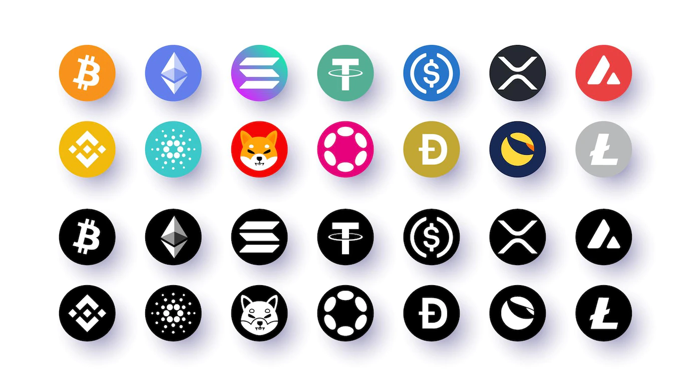

<p style="text-align: center;">
  
</p>

# ⚙️ NFT History Logs 

#### NFT History Logs is the Ethereum PHP API which connects to [JSON RPC](https://www.jsonrpc.org/specification) specs to get the desired logs of an nft contract address or specific nft with id on Ethereum Chain.

#### Supported Chain: just Ethereum Chain for now!

#### You need to run a local or remote Ethereum node to use this library.
#### You could also use testnet like [Ganache](https://trufflesuite.com/ganache/) or [Cloudflare ETH](https://developers.cloudflare.com/web3/ethereum-gateway/) network.

#### You could also set any network endpoints like [Alchemy](https://www.alchemy.com/) or [Infura](https://www.infura.io/) or anything you want.

## Installation 
```bash
 composer require nfthistory/nfthistorylogs
```

## Usage
### New instance
```php
<?php

require "vendor/autoload.php";

use Nft\History\nftHistory;

$contractAddress = "CONTRACT ADDRESS";
$provider = "http://localhost:8545";

$NftHistory  = new nftHistory($contractAddress, $provider);

print_r($NftHistory );
    
// Output:
(
    [contractAddress:protected] => contract address
    [provider] => http://localhost:8545
)
```
the contract address and provider must be string type.

### transferTrxById
You can get and filter all transfer transactions of an specific nft by using Token ID.
The majority of the NFT market provided this token ID, but if they did not, you could still obtain it on [Etehscan.io](https://etherscan.io/)
```php
$NftHistory->transferTrxById($tokenId, $fromBlock, $toBlock);
```
$tokenId must be string number, $fromBlock and $toBlock must be string of hex type (you could set "0x0" as a first block and "latest" as the final block)

### allTransferTrx
you can filter transactions history based on transfer event.
```php
$NftHistory->allTransferTrx($fromBlock, $toBlock);
```
$fromBlock and $toBlock must be string of hex type (you could set "0x0" as a first block and "latest" as the final block)

### allTransferTrxHashAndIds
You can get all transfer information arranged and categorized by token ids. It returns an object.
```php
$nfthistory->allTransferTrxHashAndIds();
```

### trxByHash
You can get information of an specific transaction by passing transaction hash.
it returns an Object. the trxHash variable is necessary.
```php
 $nfthistory->trxByHash($trxHash);
```

### allTrx
You can get all transaction of an nft contract address without any filter. Be aware that most networks will throw an exception in this situation due to a limitation in log output. You must set a specific block number instead of "latest" for the $toBlock variable.
```php
$NftHistory->allTrx($fromBlock, $toBlock);
```

### receiptByTrxHash
You can get the information of receipt transaction by using this function. pass transaction hash to this function. it returns an object of transaction.
```php
$NftHistory->receiptByTrxHash($trxHash);
```

### topSellNfts
showing the top selling nfts to the lowest prices. you can set mode on "singleThread" and "multiThread". $mode must be string. singleThread is slower and request single by single and multiThread is a bulk request to server. be aware of rate limit of the destination server. $countRank is the numbers of the values you want to obtain. it is optional and must not exceed the numbers of tokens of an contract address. it must be in decimal format. $fromBlock and $toBlock are optional.
```php
$NftHistory->topSellNfts($mode, $countRank, $fromBlock, $toBlock);
```

### nftTrxWei
every transaction has a property called "data". this section is a hexadecimal number in Wei format. you must pass transaction hash to return an array of data. you can also filter by using $eventName. $eventName is optional.
```php
$NftHistory->nftTrxWei($transactionHash, $eventName);
```

### weiToEther
convert WEI values of token to Ether format _ if its hex format, will be converted to decimal. 
```php
$NftHistory->weiToEther($weiValue);
```

### eventSig
You could also get a 256-bit hashed event signature. event signatures supported at this time: "Transfer" , "Approval" and "ApprovalForAll".
```php
$NftHistory->eventSig("Transfer");
```
event name could be this 3 option as string type: "Transfer" , "Approval" and "ApprovalForAll"

### fromAddress
if you get specific nft transaction and you want identify the sender address of the transaction, pass transaction hash. $eventName is optional:
```php
$NftHistory->fromAddress($trxHash, $eventName);
```

### toAddress
If you receive a specific nft transaction and want to identify the recipient address, pass transaction hash. $eventName is optional:
```php
$NftHistory->toAddress($trxHash, $eventName);
```

### tokenId
I assume you have topics for desired transaction objects and you want to know the tokenid of an nft.
```php
$NftHistory->tokenId($topics);
```

### genesisBlock
The Genesis Block is the birth block of an nft. so:
```php
$NftHistory->genesisBlock();
```
### docker-compose
this library is tested on php version 8.1, to test it just try this command:
```php
docker-compose up
```

### contribution
If you are interested in contributing to this project, I will be very glad ^__^

### My Social Networks
You can get in contact with me by:
<br>
[Hackernoon](https://hackernoon.com/@xmrrabbitx)
<br>
[Linkedin](https://www.linkedin.com/in/xmrrabbitx/)

### License
MIT